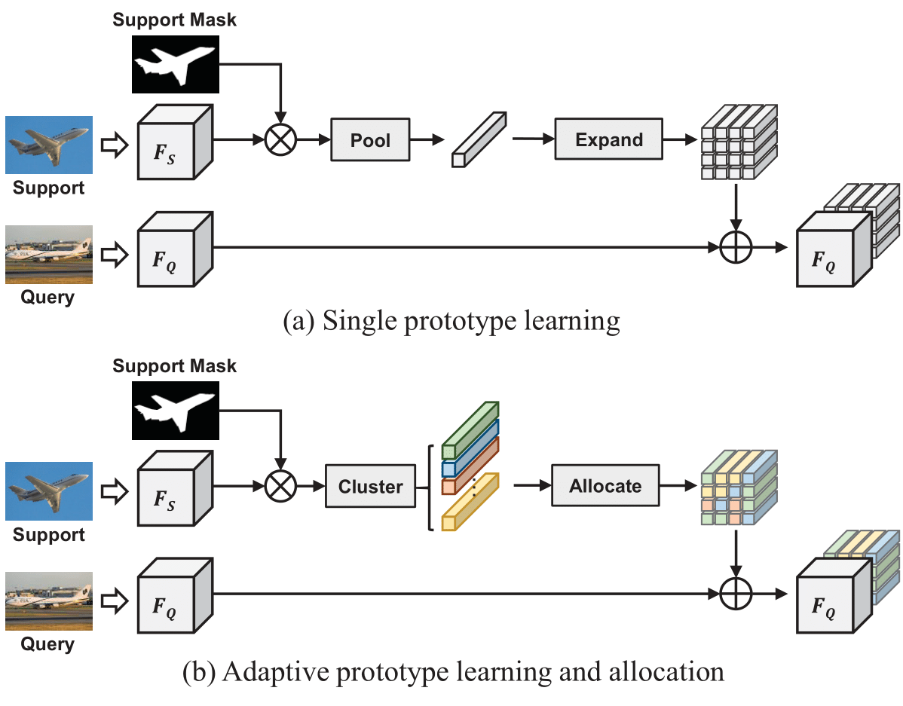

# ASGNet
The code is for the paper "Adaptive Prototype Learning and Allocation for Few-Shot Segmentation" (accepted to CVPR 2021) [[arxiv](https://arxiv.org/abs/2104.01893)]


## Overview
+ `data/` includes config files and train/validation list files
+ `model/` includes related model and module
+ `tool/` includes training and testing scripts
+ `util/` includes data processing, seed initialization

## Usage
### Requirements
python==3.7, torch==1.6, scipy, opencv-python, tensorboardX

### Dataset
Prepare related datasets: Pascal-5<sup>i</sup> ([VOC 2012](http://host.robots.ox.ac.uk/pascal/VOC/voc2012/), [SBD](http://home.bharathh.info/pubs/codes/SBD/download.html)) and COCO-20<sup>i</sup> ([COCO 2014](https://cocodataset.org/#download))

### Pre-trained models
- Pre-trained backbones and models can be found in [Google Driver](https://drive.google.com/drive/folders/1dEJL_KSkZZ0nIEy6zwqqb93L4zBDvCV-?usp=sharing)
- Download backbones and put the pth files under `initmodel/` folder

### Test and  Train
+ Specify the path of datasets and pre-trained models in the data/config file
+ Use the following command 
  ```
  sh tool/test.sh|train.sh {data} {model} {split_backbone}
  ```

E.g. Test ASGNet with ResNet50 on the split 0 of PASCAL-5i:
```
sh tool/test.sh pascal asgnet split0_resnet50
```

## Citation
Please consider citing the paper if you find it useful:
```
@inproceedings{li2021asgnet,
  title={Adaptive Prototype Learning and Allocation for Few-Shot Segmentation},
  author={Li, Gen and Jampani, Varun and Sevilla-Lara, Laura and Sun, Deqing and Kim, Jonghyun and Kim, Joongkyu},
  booktitle={CVPR},
  year={2021}
}
```
## References
The code is based on [semseg](https://github.com/hszhao/semseg) and [PFENet](https://github.com/Jia-Research-Lab/PFENet). Thanks for their great work!
